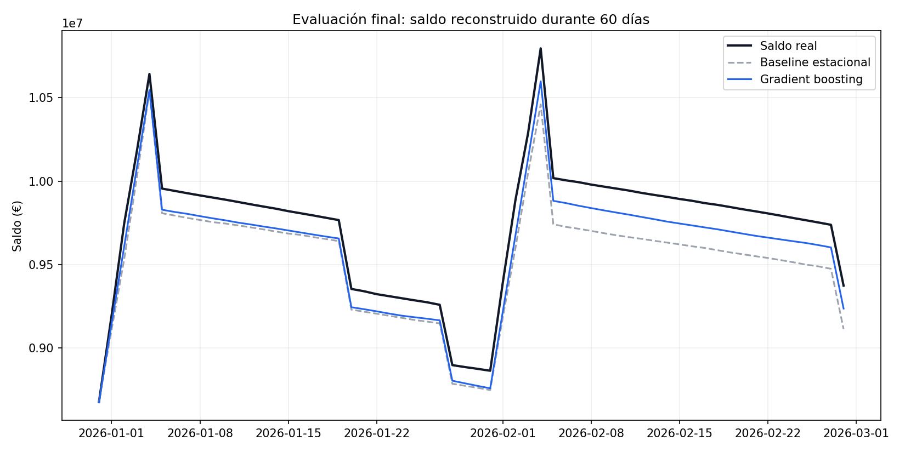
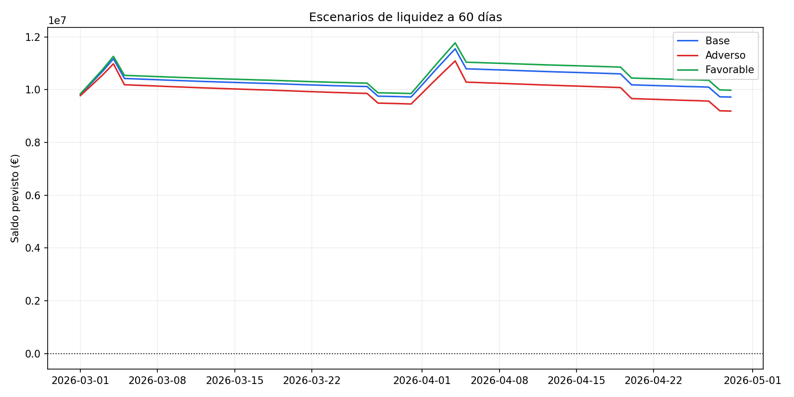

# Previsión de tesorería con validación temporal

Proyecto de portfolio sobre previsión de liquidez para una empresa ficticia
multisede. El objetivo es estimar el saldo de caja a 60 días sin tratar todos los
movimientos del mismo modo:

- los pagos conocidos por calendario se incorporan como flujos programados;
- los cobros y pagos operativos se estiman a partir de su histórico;
- el saldo se reconstruye desde la posición de caja inicial;
- la previsión se presenta en escenarios base, adverso y favorable.

Los datos son completamente sintéticos. El proyecto no contiene información de
ninguna empresa real.

## Problema de negocio

Una previsión de tesorería debe responder a tres preguntas:

1. ¿Qué movimientos ya conocemos?
2. ¿Qué movimientos necesitan una estimación?
3. ¿Cómo cambia la posición de liquidez si los cobros o los costes se desvían?

Por ese motivo, el modelo no predice directamente el saldo bancario. Primero
estima los flujos inciertos y después añade nóminas, deuda, impuestos y otros
pagos programados.

## Metodología

El histórico simulado abarca desde enero de 2021 hasta febrero de 2026.
Contiene cobros, pagos operativos, pagos programados, flujo neto y saldo.

Se comparan dos métodos:

- **Baseline estacional:** utiliza el mismo día natural del año anterior.
- **Gradient boosting:** dos modelos con variables de calendario, uno para
  cobros y otro para pagos operativos.

La selección se realiza con tres ventanas de validación temporal de 60 días. El
periodo final, del 31 de diciembre de 2025 al 28 de febrero de 2026, se utiliza
una sola vez después de seleccionar el método.

## Resultados

El gradient boosting obtuvo el menor error medio del saldo en validación:

| Método | MAE medio del saldo en validación |
|---|---:|
| Baseline estacional | 210.763 € |
| Gradient boosting | **165.697 €** |

Resultados sobre el periodo de prueba final:

| Método | WAPE del flujo diario | MAE del saldo | Error del saldo final |
|---|---:|---:|---:|
| Baseline estacional | 11,68 % | 193.788 € | -259.802 € |
| Gradient boosting | **7,95 %** | **125.952 €** | **-136.960 €** |

En este escenario sintético, el modelo reduce aproximadamente un **35 %** el
MAE del saldo frente al baseline. Este resultado no debe interpretarse como una
garantía de rendimiento con datos reales.



## Escenarios de liquidez

- **Base:** previsión sin ajustes.
- **Adverso:** cobros un 10 % inferiores y pagos operativos un 5 % superiores.
- **Favorable:** cobros un 5 % superiores y pagos operativos un 2 % inferiores.



Los porcentajes son supuestos ilustrativos y no probabilidades calibradas.

## Estructura

```text
.
├── data/                       # Datos sintéticos reproducibles
├── reports/                    # Métricas, previsiones y gráficos
├── src/cashflow_forecasting/   # Modelado y evaluación
├── tests/                      # Pruebas de generación y previsión
├── generador_datos.py          # Simulador financiero
├── train_model.py              # Backtesting, prueba final y escenarios
└── cash_flow_forecasting.ipynb # Recorrido explicativo
```

## Ejecución

```bash
python -m venv .venv
source .venv/bin/activate       # Windows: .venv\Scripts\activate
pip install -r requirements.txt
python train_model.py
pytest -q
```

El entrenamiento vuelve a generar los datos y todos los informes de forma
determinista.

## Limitaciones

- Los datos han sido creados para este ejercicio y simplifican una tesorería real.
- Los pagos programados se consideran conocidos y se añaden sin error.
- No se modelizan retrasos de clientes, divisas, líneas de crédito ni cambios
  inesperados del calendario de pagos.
- Los escenarios son análisis de sensibilidad, no intervalos de confianza.
- Antes de utilizar una solución similar en producción habría que validar la
  calidad de los datos, los supuestos financieros y el error por horizonte.
